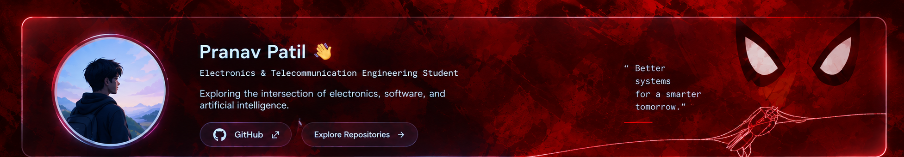

### Electronics & Telecommunication Engineering Student

*Exploring the intersection of electronics, software, and artificial intelligence.*

---

## GitHub Analytics

> **Note:** Stats and language cards depend on public repository activity and a third-party service. The language card may show no data until you publish repositories containing detectable code.

---

## About Me

I'm an Electronics & Telecommunication engineering student interested in how technology can solve real-world problems. I enjoy learning new concepts, experimenting with ideas, and understanding how hardware and software work together.

- 🎓 **Background:** Electronics & Telecommunication Engineering
- ✨ **Interests:** Artificial intelligence, embedded systems, and intelligent automation
- 🔌 **Exploring:** Microcontrollers, sensors, digital logic, and communication systems
- 🌱 **Learning:** Programming, software development, and problem-solving
- 🤝 **Open to:** Hackathons, collaboration, and learning opportunities

---

## Skills & Tools

**Programming & Development**

**Embedded Systems & Electronics**

---

## Currently Focused On

| Area | Focus |
|---|---|
| Programming | Strengthening coding and problem-solving fundamentals |
| Artificial Intelligence | Exploring AI and intelligent automation |
| Embedded Systems | Understanding microcontrollers and hardware–software integration |
| Development | Learning Git, GitHub, and software development workflows |
| Collaboration | Learning through hackathons and teamwork |

---

### Learn continuously · Build thoughtfully · Keep exploring

[GitHub Profile](https://github.com/techie-pranav) · [Browse Repositories](https://github.com/techie-pranav?tab=repositories)

